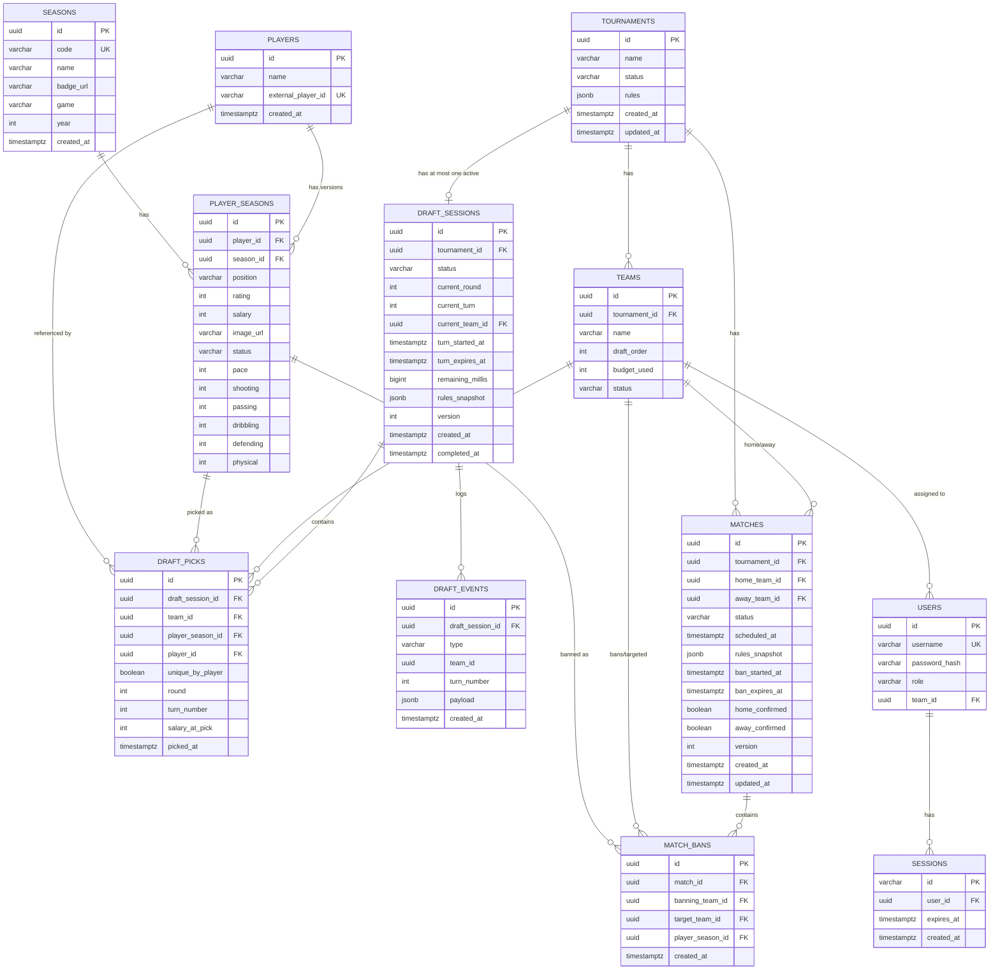

## 2. Entity-Relationship Diagram (ERD)

### Key Database Constraints

| Table            | Constraint                                                                   | Purpose                                                        |
| ---------------- | ---------------------------------------------------------------------------- | -------------------------------------------------------------- |
| `seasons`        | `UNIQUE(code)`                                                               | Unique season identifier code (e.g. 23UCL, ICON)               |
| `player_seasons` | `UNIQUE(player_id, season_id)`                                               | One entry per player per season card                           |
| `player_seasons` | `CHECK(salary >= 1)`                                                         | Salary must be a positive integer >= 1                         |
| `players`        | `UNIQUE(external_player_id)`                                                 | Deduplication strictly by external source ID (required)        |
| `players`        | `GIN(immutable_unaccent(name) gin_trgm_ops)`                                  | Fast trigram player name search (`GET /api/player-seasons?search=`) with unaccent wrapper |
| `draft_picks`    | `UNIQUE(draft_session_id, player_season_id)`                                 | Exact card version can never be picked twice in same draft     |
| `draft_picks`    | `UNIQUE(draft_session_id, player_id) WHERE unique_by_player`                 | Partial unique index: no duplicate player identity when `uniqueBy=PLAYER` |
| `draft_picks`    | `UNIQUE(draft_session_id, turn_number)`                                      | Exactly one pick per turn in draft session                     |
| `teams`          | `UNIQUE(tournament_id, draft_order)`                                         | Unique pick order within tournament                            |
| `teams`          | `CHECK(budget_used >= 0)`                                                    | Budget never goes negative                                     |
| `draft_sessions` | `version INT NOT NULL DEFAULT 0`                                             | Monotonically increasing draft state version counter           |
| `draft_sessions` | `UNIQUE(tournament_id) WHERE status IN ('WAITING','PICKING','PAUSED')`       | At most one active draft per tournament (partial unique index) |
| `matches`        | `version INT NOT NULL DEFAULT 0`                                             | Concurrency version counter for match & ban phase              |
| `match_bans`     | `UNIQUE(match_id, banning_team_id, player_season_id)`                        | Team cannot ban the same player card twice in a match          |

> **Database rules (Python/Alembic):**
>
> - Migrations via **Alembic only**. `Base.metadata.create_all()` is forbidden in application code. Tests run real Alembic migrations via testcontainers.
> - Autogenerated migrations are a starting point only — review by hand. Write partial indexes, CHECK constraints and server defaults explicitly.
> - Set a SQLAlchemy `naming_convention` on `MetaData` so constraint/index names are stable. Required because `IntegrityError` handling maps constraint names to domain errors.
> - Enums: `VARCHAR + CHECK constraint` (no PostgreSQL enum types). Timestamps: `timestamptz` (`DateTime(timezone=True)`), always timezone-aware UTC in Python. Salary/budget: `INT`.
> - GIN index with `pg_trgm + unaccent` on `players.name` for player name search (`GET /api/player-seasons?search=`). PostgreSQL `unaccent` is not `IMMUTABLE`: the Alembic migration must define an immutable wrapper function (e.g. `immutable_unaccent(text)`) and index on it. The importer still must NOT use fuzzy matching (deduplication strictly by `externalPlayerId`).

---

