## 3. Draft Session State Machine

```mermaid
stateDiagram-v2
    [*] --> WAITING : POST /api/tournaments/{id}/draft/start\n[ADMIN only]

    WAITING --> PICKING : First turn begins automatically\nafter session is created\n(currentTeamId = team with draftOrder=1, version=1)

    PICKING --> PICKING : Successful PICK\nadvance turn to next team\nincrement version

    PICKING --> PICKING : Timer expires → AutoPickCheapest\n(auto-picks 1 card;\nturn advances to next team;\nconsumes turn, increment version)

    PICKING --> PAUSED : POST /api/drafts/{id}/pause\n[ADMIN only]\n→ stores remainingMillis; increment version

    PAUSED --> PICKING : POST /api/drafts/{id}/resume\n[ADMIN only]\n→ turnExpiresAt = now + remainingMillis; increment version

    PICKING --> COMPLETED : Draft completed:\nall team rosters reach rosterSize,\nOR max rounds finished,\nOR no affordable active unpicked card\n→ DraftEvent(COMPLETE); increment version

    PICKING --> CANCELLED : POST /api/drafts/{id}/cancel\n[ADMIN only]\n→ tournament returns to READY;\nDraftSession kept as history; increment version

    PAUSED --> CANCELLED : POST /api/drafts/{id}/cancel\n[ADMIN only]\n→ tournament returns to READY;\nDraftSession kept as history; increment version

    COMPLETED --> [*]
    CANCELLED --> [*]
```



### State Descriptions

| State       | Meaning                                                                                                                                                                             | Who can act                            |
| ----------- | ----------------------------------------------------------------------------------------------------------------------------------------------------------------------------------- | -------------------------------------- |
| `WAITING`   | Session created, not yet started                                                                                                                                                    | System transitions to PICKING immediately |
| `PICKING`   | Active — a team's turn is running, timer is counting                                                                                                                                | TEAM_USER (pick), ADMIN (pause, cancel) |
| `PAUSED`    | Timer frozen, `remainingMillis` stored                                                                                                                                              | ADMIN (resume, cancel)                 |
| `COMPLETED` | All rosters have reached `rosterSize` picks, max rounds finished, or no affordable active unpicked card exists in allowed seasons.                                                  | Nobody (read-only)                     |
| `CANCELLED` | Terminated by ADMIN via `POST /api/drafts/{id}/cancel` (allowed from PICKING or PAUSED). Tournament status returns to `READY`, allowing draft re-start. Session kept in DB as history. | Nobody (read-only)                     |

### Turn Advance Logic (DraftOrderStrategy — LINEAR)

```
Round 1:  Team[1] → Team[2] → ... → Team[N]
Round 2:  Team[1] → Team[2] → ... → Team[N]
...
Round rosterSize: Team[1] → Team[2] → ... → Team[N]
```

- **One Pick Per Turn:** Each turn gives the current team exactly one pick in a single draft stage.
- **Single-Pick Requests:** Each call to `POST /api/drafts/{id}/picks` picks **one player card** with `{ playerSeasonId, expectedVersion }`.
- **Turn Advancement:** After a successful pick (or timeout auto-pick/skip), the turn immediately advances to the next team according to `DraftOrderStrategy`, and the timer (`turnStartedAt`, `turnExpiresAt`) is re-initialized for the next team.
- **Timeout Policy (`AutoPickCheapest` default):** When a turn expires, `AutoPickCheapest` automatically picks the cheapest valid ACTIVE unpicked card in allowed seasons that satisfies budget feasibility. If `SkipTurn` is used, the turn is skipped (consumes turn, writes `SKIP` event, no `DraftPick` inserted). In both cases, the turn advances to the next team.
- **Roster & Completion:** Skip teams whose roster is already full (`rosterSize`). After the last team in a round → `currentRound++`, wrap back to `draftOrder = 1`. Draft transitions to `COMPLETED` when all teams reach `rosterSize` picks, or when no ACTIVE unpicked `PlayerSeason` exists with `salary <=` any team's `budgetRemaining`. Writes `DraftEvent(COMPLETE)`.

---

